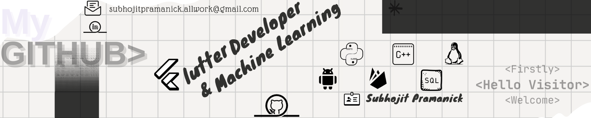

# Hello World!, I'm Subhojit, a Indian Flutter Developer 👋🏼:
🛜 currently working on a project:  [vchat](https://github.com/subhojitpramanick/clickFix.git) 👨🏼‍🎓 studying Information Technology At Haldia Institute of Technology 👨🏼‍💻 working as a Android developer since 2023 </i>
###

###
<!---

  
  

I use standard HTML tags, like
-->
###

###

# 💻 Tech Stack:
###

###

  
  
  
  
  
  
  
  
  
  
  
  
  
  
  
  
  
  
  

###

  
  
  
  

###
<h3 align="left">🔥   My Stats :</h3>
###

  

###

<picture>
  <source media="(prefers-color-scheme: dark)" srcset="https://raw.githubusercontent.com/subhojitpramanick/subhojitpramanick/output/github-snake-dark.svg" />
  <source media="(prefers-color-scheme: light)" srcset="https://raw.githubusercontent.com/subhojitpramanick/subhojitpramanick/output/github-snake.svg" />
  
</picture>
